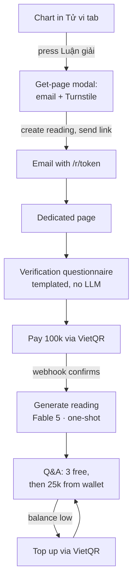

# AI-assisted Tử Vi Reading ("Luận giải") — Design Docs

Planning documents for the paid, AI-assisted interpretation layer on top of
the free lá số tử vi chart. **Design only — no implementation yet.**

## Contents

- [Functional Requirements (FR)](./FR.md) — what the system does.
- [Non-Functional Requirements (NFR)](./NFR.md) — how well it must do it.
- [Architecture Decision Records (ADR)](./adr/) — why the key choices were
  made.

## Decisions at a glance

| ADR | Decision |
| --- | --- |
| [0001](./adr/0001-no-accounts-capability-url.md) | No accounts — access via HMAC-signed capability URLs |
| [0002](./adr/0002-worker-supabase-topology.md) | Cloudflare Worker API + Supabase Postgres (Worker is sole DB client) |
| [0003](./adr/0003-payments-vietqr-credits.md) | VietQR auto-reconciliation + prepaid credit wallet |
| [0004](./adr/0004-email-only-delivery.md) | Email-only delivery for MVP, behind a pluggable notifier |
| [0005](./adr/0005-model-fable5-prompt-caching.md) | Fable 5 for reading & Q&A, with prompt caching |
| [0006](./adr/0006-templated-verification-no-llm-prepay.md) | Templated verification — no LLM spend before payment |
| [0007](./adr/0007-abuse-ddos-defense.md) | Layered abuse/DDoS defense + cost circuit breakers |
| [0008](./adr/0008-server-recompute-idempotent-generation.md) | Server-authoritative chart + idempotent one-shot generation |

## Flow

The critical property: **every LLM call sits to the right of the payment
step.** The pre-payment funnel only does static compute, one rate-limited
email, and a Turnstile check (ADR-0006, ADR-0007).

## Delivery phases

- **Phase 0 — no external accounts required.** Supabase schema, Worker
  endpoints, templated verification bank, Fable 5 reading + Q&A, email
  delivery, the Explain modal and dedicated page. Payment is behind a
  **dev-unlock flag**. Fully demoable end-to-end except real money.
- **Phase 1 — payments live.** Swap the dev-unlock for real VietQR
  (SePay/Casso) once a bank account + provider account exist.
- **Later.** MoMo/ZaloPay/VNPay providers; Zalo/SMS channels; PDF export;
  feedback-driven tuning.

## To procure (external, product owner)

Claude API key with billing · Cloudflare Turnstile keys · SePay/Casso
account + a Vietnamese bank account · email sending-domain verification for
`astrologik.app` · Supabase project.

## Open questions for the next round

- Exact verification **statement bank** contents (needs tử vi domain input).
- Reading **section structure** and the Fable 5 **prompt** wording.
- Credit **bundle** sizes/prices and refund policy specifics.
- Retention period for contact data.
